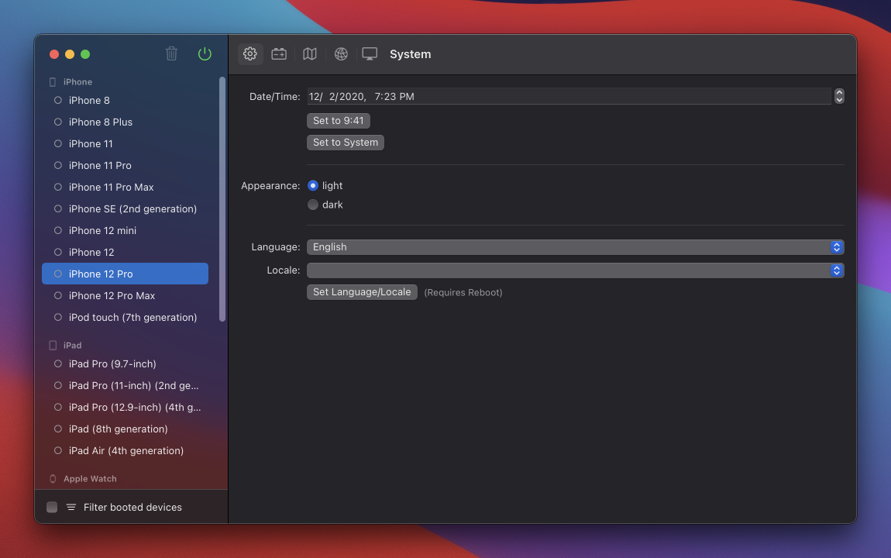

# Control

Control your iOS Simulator



## Build

Prerequisites

- [Brew](https://brew.sh)
- [Xcodegen](https://github.com/yonaskolb/XcodeGen)

```sh
git clone git@github.com:ridevelo/control.git
cd control
xcodegen
```

## Features

**System**

- [x] Time
- [x] Appearnace
- [x] Localization

**Battery**

- [x] State
- [x] Level

**Map**

- [x]  Location

**Network**

- [x] Carrier
- [x] Type
- [x] Wifi
- [x] Cellular

**Screen**

- [x] Screenshot
- [ ] Screen recording